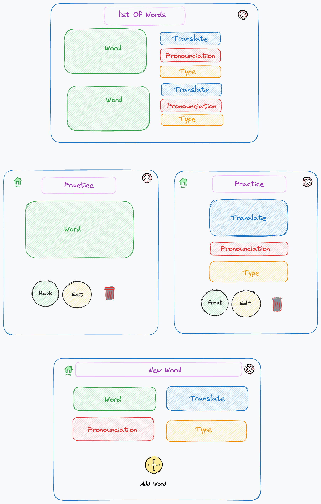

Project 4 
- **Project Name:** VOCABUILDER
- **Project By:** Haleh Bozorgnia

Creating a website dedicated to learning new words can be a valuable resource for language enthusiasts, students, and anyone looking to expand their vocabulary.
VOCBUILDER  is a site for user who wants to learn new language and memorize new words.
Users can view, post, edit, and delete vocablurary and it's translation, pronounciation and type. The data model for each post will be an "Entry", and each entry include a vocab, a translation, a pronounciation, and type. Data for the app will be stored, retrieved from, added to, and deleted from the Neon Database. The site is built using DjangoRestFull Framework.
Users can find the specific saved vocab and also can search for the definition of the vocab in the English dictionary.
## Approach
The call to the backend API was coded in the loaders.js page . The CRUD actions were coded into the actions.js file where each action was coded to hit the corresponding route on the backend API, allowing those actions to function properly for the user. The visible UI was written into the 'components' and 'pages' folders, and also makes use of my API in order to render relevant data programatically from entries in database. 

 ---
### Links
- [LINK TO GITHUB]()
- [LINK TO DEPLOYED WEBSITE]()

- [LINK TO TRELLO](https://trello.com/invite/b/LxThpsiN/ATTI1711d7c899f45a7d9a96edecf816d92341EFFE77/vocabuilder)

---
### Technologies  
HTML, CSS, JS, Node,EJS, PSQL, React, Django, RestFull Framework

---
## React Routes

| NAME       | PATH               |
| ---------- | ------------------ |
| INDEX      | /                  |
| SHOW       | /:id               |
| CREATE     | /create            |
| UPDATE     | /update/:id        |
| DELETE     | /delete/:id        |
| SEARCH     | /search            |
| Practic    | /practice          |
| Dictionary | /dictionary/:search|

## Components
- Header.js
- FlipCard.js
- Dictionary.js

## Mockup of UI  
   
